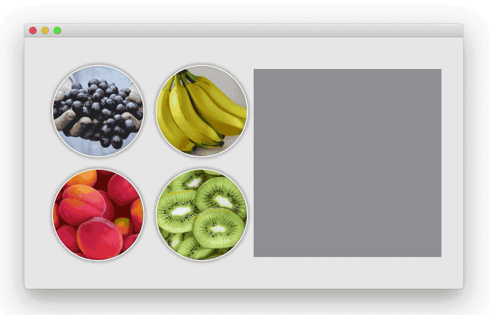
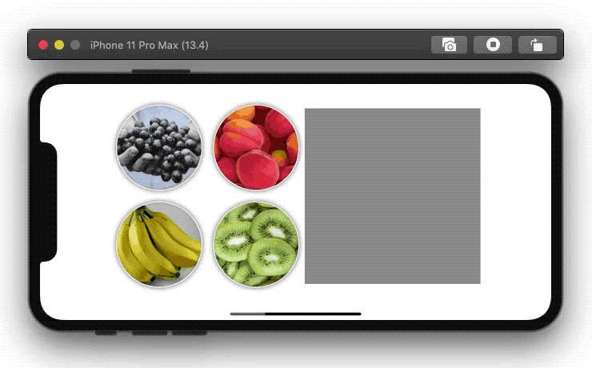

### SwiftUI 中的Drag（拖拽） & Drop（放下）

SwiftUI合并了一些方法一些协议来为Drag和Drop操作提供方便。知道iOS13.4 大多数的Drag，Drop都是macOS独有的，还好在最新的iOS13.14beta 版本中迁移了过来。

拖拽在SwiftUI中非常简单。然而，如果你对macOS或者iOS中的Drag，Drop感到很陌生，那么重点就是**对NSItemProvider的理解**。这是一个类(class)，提供者有关拖拽的数据，这个类已经存在很很多年了，如果本文中的示例不充足，请继续在网络上探索，它们可能与SwiftUI不相关，但是在NSItemProvider这部分是一样的。

接下来，我们将要讨论一些有关Drap&Drop与SwiftUI协同工作时的bug，我们也会看到ListView和一些特殊的注意事项。

#### Drag

一次drag和drop 操作，就跟你想的一样，由两部分组成，drag和drop。对于drag来说，SwiftUI只有一个方法叫做 onDrag()，给某个view添加这个modifier，就相当于你做了两件事：

	1. 告诉SwiftUI这个view是可以拖拽的
 	2. 实例化了一个NSItemProvider类来存储相关数据

```swift
func onDrag(_ data: @escaping() -> NSItemProvider) -> some View
```

#### Drop

SwiftUI拥有一个modifier叫做onDrop()。调用这个方法，就相当于我们告诉swiftUI是否允许这个view被放下，哪些类型的对象可以被放下，或者是其他有用的信息，根据需要，可以选择三种版本的modifier

```swift
//最简单的形式，让你定义一个闭包当这个view被放下时执行
func onDrop(of supportedTypes: [String], isTargeted: Binding<Bool>?, perform action: @escaping ([NSItemProvider]) -> Bool) -> some View

//跟第一个差不多，但是同时为你提供了view的落点信息
func onDrop(of supportedTypes: [String], isTargeted: Binding<Bool>?, perform action: @escaping ([NSItemProvider], CGPoint) -> Bool) -> some View

//功能最全的：将会让你提供一个DropDelegate去处理drop相关的一系列操作
func onDrop(of supportedTypes: [String], delegate: DropDelegate) -> some View

```

在这篇文章中，我们将会使用功能最全的选项，就是那个DropDelegate。剩下的两个方法非常的简洁明了。很快我将会在同一个app中展示一下例子，如果你理解这些例子了，那剩下两个方法将会被轻松掌握。

下面这个小视频展示了一个例子，这是macOS的一个bug每当拖拽起一个view的时候，这个view的预览图片竟然是缺失的（而不是缩略图），到目前为止，我一直不知道这个问题该怎么解决。但是还好，**这个问题不会影响在iOS上的正确显示**





以下代码可以在macOS上使用，简单修改下就可以在iOS上运行，修改的部分就是macOS依赖于NSImange而iOS依赖于UIImage

当然，还有一个bug，，，这个bug只影响iOS：DropInfo应该提供local坐标，但现在，他提供的是全局坐标，但写这篇文章的时候iOS13.4还是beta版本，在可预期的将来应该会得到修复

理解下面代码

```swift
import SwiftUI

struct ContentView: View {
    let img1url = Bundle.main.url(forResource: "Images/grapes", withExtension: "png")
    let img2url = Bundle.main.url(forResource: "Images/banana", withExtension: "png")
    let img3url = Bundle.main.url(forResource: "Images/peach", withExtension: "png")
    let img4url = Bundle.main.url(forResource: "Images/kiwi", withExtension: "png")
    
    var body: some View {
        HStack {
            VStack {
                DragableImage(url: img1url!)
                
                DragableImage(url: img3url!)
            }
            
            VStack {
                DragableImage(url: img2url!)
                
                DragableImage(url: img4url!)
            }
            
            DroppableArea()
        }.padding(40)
    }
    
    struct DragableImage: View {
        let url: URL
        
        var body: some View {
            Image(nsImage: NSImage(byReferencing: url))
                .resizable()
                .frame(width: 150, height: 150)
                .clipShape(Circle())
                .overlay(Circle().stroke(Color.white, lineWidth: 2))
                .padding(2)
                .overlay(Circle().strokeBorder(Color.black.opacity(0.1)))
                .shadow(radius: 3)
                .padding(4)
                .onDrag { return NSItemProvider(object: self.url as NSURL) }//对View进行包装后调用.onDrag方法，返回一个使用图片url初始化的NSItemProvider
        }
    }
    
    struct DroppableArea: View {
        @State private var imageUrls: [Int: URL] = [:]
        @State private var active = 0
        
        var body: some View {
            let dropDelegate = MyDropDelegate(imageUrls: $imageUrls, active: $active)
            
            return VStack {
                HStack {
                    GridCell(active: self.active == 1, url: imageUrls[1])
                    
                    GridCell(active: self.active == 3, url: imageUrls[3])
                }
                
                HStack {
                    GridCell(active: self.active == 2, url: imageUrls[2])

                    GridCell(active: self.active == 4, url: imageUrls[4])
                }
                
            }
            .background(Rectangle().fill(Color.gray))
            .frame(width: 300, height: 300)
            .onDrop(of: ["public.file-url"], delegate: dropDelegate)
            
        }
    }
    
    struct GridCell: View {
        let active: Bool
        let url: URL?
        
        var body: some View {
            let img = Image(nsImage: url != nil ? NSImage(byReferencing: url!) : NSImage())
                .resizable()
                .frame(width: 150, height: 150)
            
            return Rectangle()
                .fill(self.active ? Color.green : Color.clear)
                .frame(width: 150, height: 150)
                .overlay(img)
        }
    }
    
    struct MyDropDelegate: DropDelegate {
        @Binding var imageUrls: [Int: URL]
        @Binding var active: Int
        
        func validateDrop(info: DropInfo) -> Bool {
            return info.hasItemsConforming(to: ["public.file-url"])
        }
        
        func dropEntered(info: DropInfo) {
            NSSound(named: "Morse")?.play()
        }
        
        func performDrop(info: DropInfo) -> Bool {
            NSSound(named: "Submarine")?.play()
            
            let gridPosition = getGridPosition(location: info.location)
            self.active = gridPosition
            
            if let item = info.itemProviders(for: ["public.file-url"]).first {
                item.loadItem(forTypeIdentifier: "public.file-url", options: nil) { (urlData, error) in
                    DispatchQueue.main.async {
                        if let urlData = urlData as? Data {
                            self.imageUrls[gridPosition] = NSURL(absoluteURLWithDataRepresentation: urlData, relativeTo: nil) as URL
                        }
                    }
                }
                
                return true
                
            } else {
                return false
            }

        }
        
        func dropUpdated(info: DropInfo) -> DropProposal? {
            self.active = getGridPosition(location: info.location)
                        
            return nil
        }
        
        func dropExited(info: DropInfo) {
            self.active = 0
        }
        
        func getGridPosition(location: CGPoint) -> Int {
            if location.x > 150 && location.y > 150 {
                return 4
            } else if location.x > 150 && location.y < 150 {
                return 3
            } else if location.x < 150 && location.y > 150 {
                return 2
            } else if location.x < 150 && location.y < 150 {
                return 1
            } else {
                return 0
            }
        }
    }
}
```


