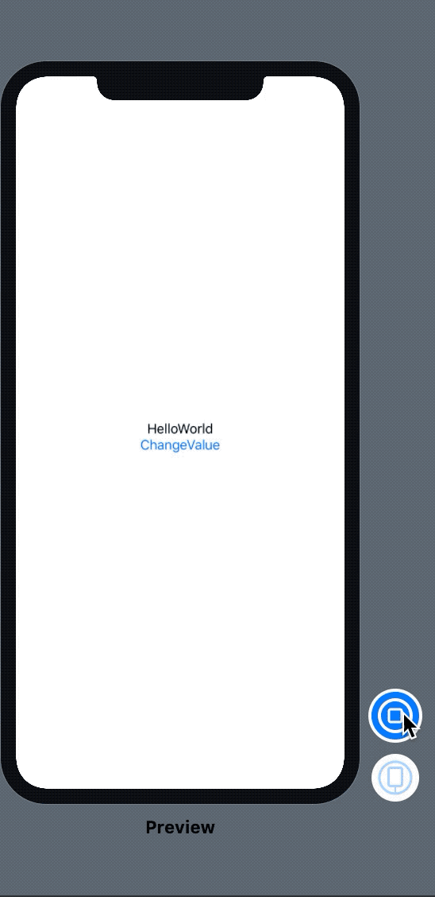
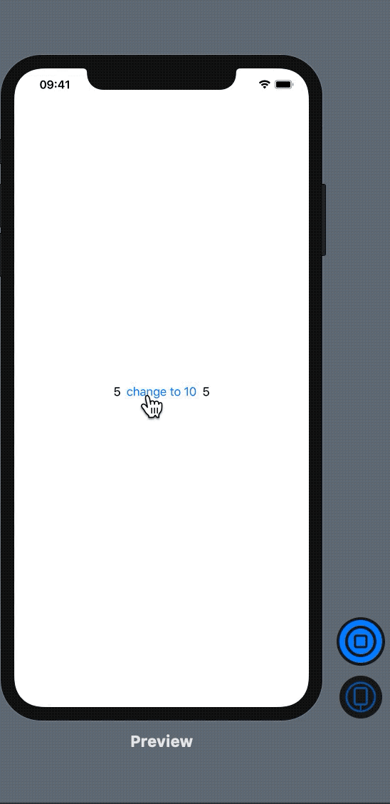
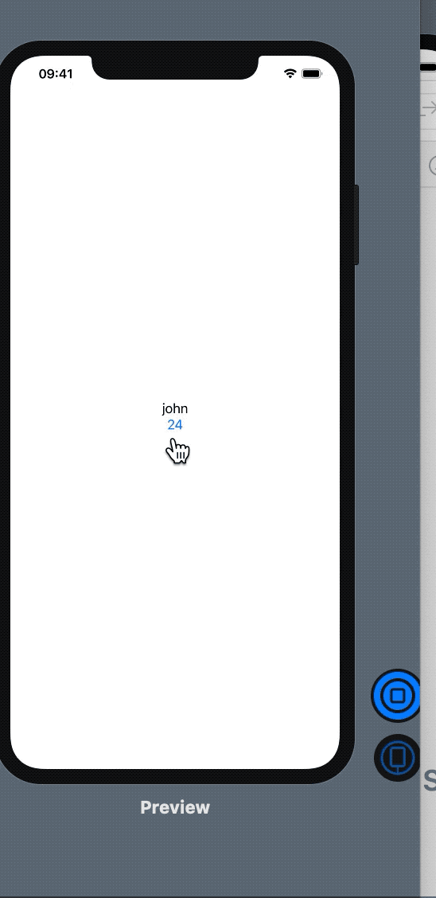
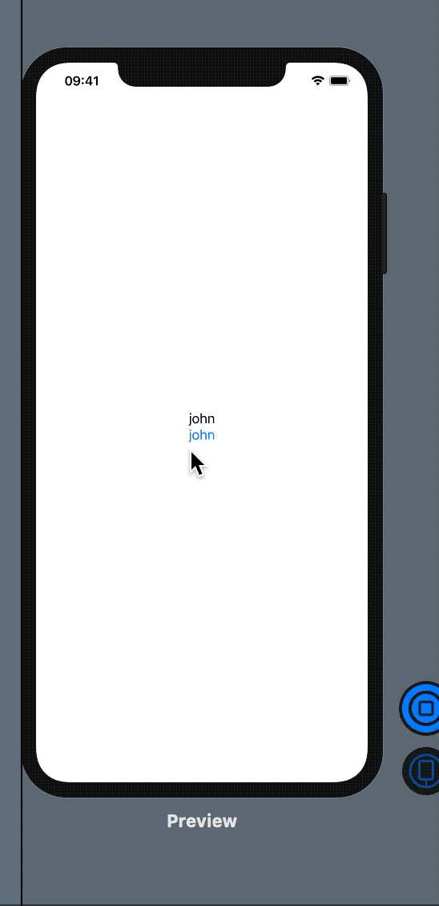

### @states 

### @Binding 

### ObservableObject,@ObservedObject

### @EnvironmentObject 

### 分别是是什么

- 急性子可以直接跳到最后看总结——不过我相信你会回来从头再看的: ）

### 前置任务：属性包装器(propertyWrapper)

上面的几个标识符统统以@开头，这表示他们均由@propertyWrapper产生，所以若要搞清楚这些东西分别有什么用需要先了解propertyWrapper

- 使用@propertyWrapper产生一个==属性包装器==：@XXX，使用这个@XXX 对属性进行包装

- 包装前我想向你介绍几个创建包装器的时需要实现的属性：wrappedValue（被包装的值）, projectedValue（呈现值）

- 包装器大概这样产生

  ```swift
  @propertyWrapper struct 包装器名称 {
    var wrappedValue: 类型 {
      get {}
      set {}
    }
    var projectedValue: 类型 {
      return 
    }
    初始化方法（可选）
  }
  ```

- 其中wrappedValue就是需要包装的那个值，直接访问，projectedValue就是你可能希望==通过包装额外呈现出来的某个值==，$+属性名称访问（下面有例子）

```swift
//我想创造一个体温温度包装器，使用该包装器包装的变量总是小于46.5且大于35（假定温度计的极限是35-46.5度），同时呈现K氏度以供参考
@propertyWrapper struct Temperature {
    var celcius = 35.0//摄氏温度
    var wrappedValue: Double {
    get {
      return celcius
    }
    set {
      celcius = newValue <= 35 ? 35 : min(46.5, newValue)//如果小于等于35就显示35度，否则在46.5和设置的温度中取小
    }
    }
    var projectedValue: Double {
      return celcius + 273.15//K氏度= 摄氏度+ 273.15
    }
}
struct People {
    @Temperature(celcius: 36.5) var templete
}
let people = People()
print("体温:",people.templete,"K氏度:",people.$templete)

```


### @states

这个只要记住一句话：**被@State包装的值发生改变时，UI将被同时更变**

个人猜测底层在set方法中对UI进行了更新

```swift
import SwiftUI
//又一个字符串HelloWorld，按下按钮后修改了被State包装的变量x，所以UI也跟着发生了变化
struct TestView: View {
    @State var x = "HelloWorld"
       var body: some View {
        VStack{
            Text(x)
            Button(action:{self.x = "Hello UI"}){
                Text("ChangeValue")
            }
        }
       }
}

struct TestView_Previews: PreviewProvider {
    static var previews: some View {
        TestView()
    }
}
```



### @Binding

**对包装的值采用传址而不是传值**（这里有C语言基础的同学应该可以理解：也就是说传递了变量本身而不是拷贝了数据过去）

```swift
import SwiftUI
//例子：Text1和Text2是两个不相关的View，他们共同使用一个数据，当该数据发生改变的时候除了要用@State告诉Text1更新UI，还要告诉Text2更新数字
//button左边的数字是Text1，右边的数字是Text2
struct Text1: View {
    @State var x = 5
    var body: some View {
        HStack{
            Text(String(x))
            Button(action: {self.x = 10}){
                Text("change to 10")
            }
            Text2(y: $x)
        }
        
    }
}
struct Text2: View {
    @Binding var y: Int
    var body: some View {
        Text(String(y))
    }
}

struct ContentView_Previews: PreviewProvider {
    static var previews: some View {
        Text1()
    }
}

```





### @ObservedObject——被观察的对象


### ObservableObject——可以观察(别人)的对象

注意⚠️：ObservableObject不是属性包装器，而是一个协议，满足协议的类(Class)中使用@Publish标记可能发生改变的属性。

- 用@Publish标记类(Class)中希望监听的属性

- 用@ObservedObject包装该类(Class)的实例，当这个实例的某些被@Publish标记的属性发生改变，（Publisher发布者）会在该实例被改变之前广播给UI(数据的订阅者)
- 默认情况下，ObservableObject会合成一个objectWillChange发布者。

```swift
import SwiftUI
//例子：代码解读在代码后面
struct ContentView: View {
@ObservedObject var john = Human(name: "john", age: 24)
    var body: some View {
        VStack {
            Text(john.name)
            Button(action:{
                self.john.happyBirthday()
            }){
                Text(String(john.age))
            }
        }
    }
}

class Human: ObservableObject {
    @Published var name: String
    @Published var age: Int

    init(name: String, age: Int) {
        self.name = name
        self.age = age
    }

    func happyBirthday() {
        self.name = "Happy birthday"
        self.age += 1
    }
    
}

struct ContentView_Previews: PreviewProvider {
    static var previews: some View {
        ContentView()
    }
}
//一个Human类满足ObservableObject协议表示这个类在监听某些属性
//@Publish name，@Publish age 表示这些属性在被监听
//@ObservedObject var john 表示john对象是被监听的对象
//点击按钮调用self.john.happyBirthday()，改变了john的名字和年龄
//UI收到了Publisher的广播，自动更新了界面
```




- 想比@State解决了哪些问题呢：这里借用喵神(https://onevcat.com)的一句话：

  ```
  如果你需要在多个 View 中共享数据，@State可能不是很好的选择;如果还需要在 View 外部操作数据，那么 @State 甚至就不是可选项了。含有少数几个成员变量的值类型，也许使用 @State 也还不错。但是对于更复杂的情况，例如含有很多属性和方法的类型，可能其 中只有很少几个属性需要触发 UI 更新，也可能各个属性之间彼此有关联，那 么我们应该选择引用类型和更灵活的可自定义方式。
  ```

  

### @EnvironmentObject

文档：A property wrapper type for ==an observable object== supplied by a parent or ancestor view.

翻译：父视图或祖先视图提供的==可观察对象==的属性包装器类型。

注意⚠️：强调可观察（Class应当满足ObservableObject协议），强调对象（必须是Class而不是Struct or Enum）

```swift

import SwiftUI
//代码解释在下面
struct ContentView: View {
@ObservedObject var john = Human(name: "john", age: 24)
    var body: some View {
        VStack {
            Text(john.name)
            Button(action:{
                self.john.happyBirthday()
            }){
                SubView()
                .environmentObject(john)
            }
        }
    }
}
struct SubView: View {
    @EnvironmentObject var john: Human
    var body: some View {
        Text(john.name)
    }
}
class Human: ObservableObject {
    @Published var name: String
    @Published var age: Int

    init(name: String, age: Int) {
        self.name = name
        self.age = age
    }

    func happyBirthday() {
        self.name = "Happy birthday"
        self.age += 1
    }
    
}
struct ContentView_Previews: PreviewProvider {
    static var previews: some View {
        ContentView()
    }
}
//在父View中的被观察对象(被@ObservedObject包装的john)在子View中使用，只需要在子View中用@EnviromentObject 包装同类型的变量并在调用子View的时候使用.environmentObject(john)显式的说明
```



## 总结

1. View与View间的公用数据使用@State + @Binding。

2. 多个View与Class间的公用数据：对View用@ObservedObject，让Class满足ObservableObject协议。

3. 父View与子View对Class间的公用数据：父View用@ObservedObject，子View用@EnvironmentObject，Class满足ObservableObject协议